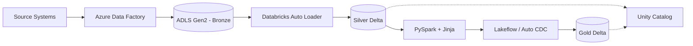
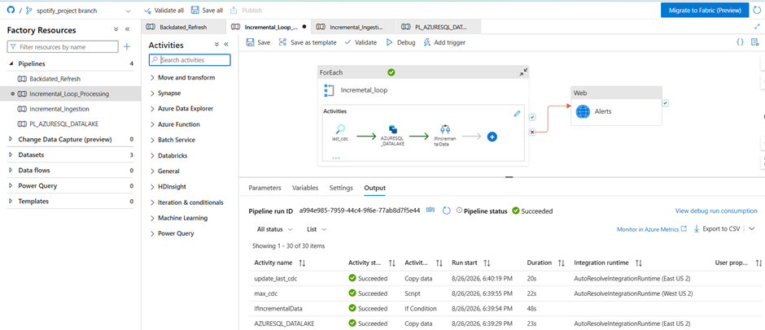
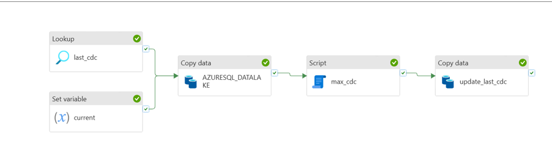
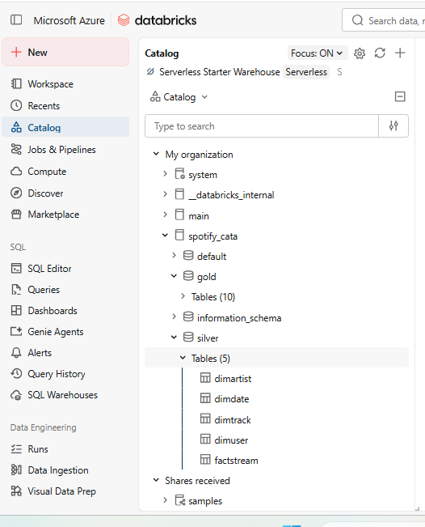
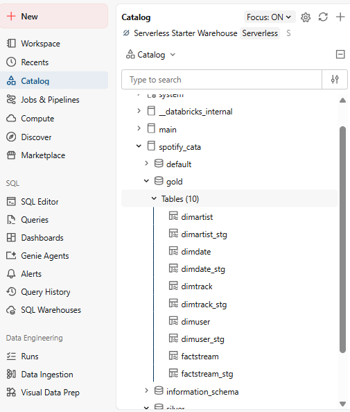
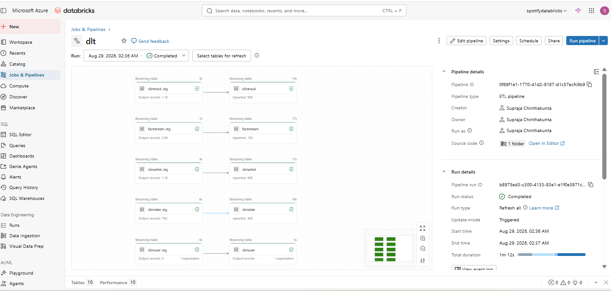
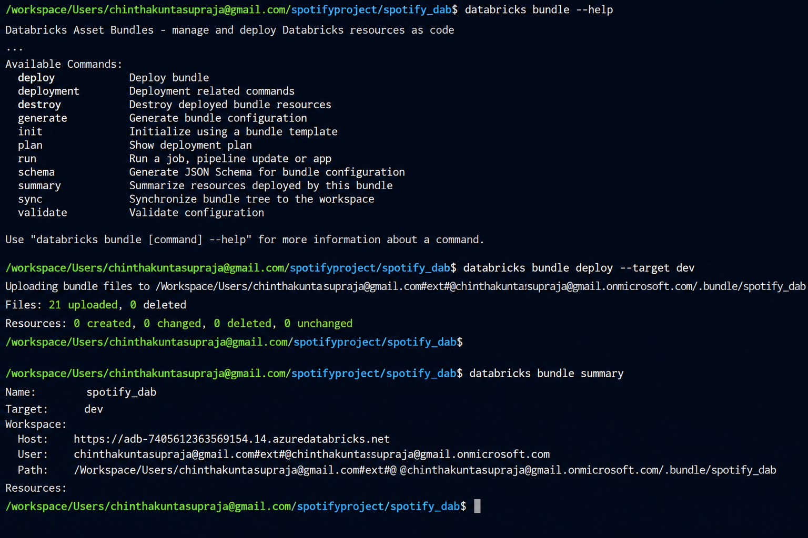

# Spotify Azure Data Engineering Project

An end-to-end **Azure Data Engineering** project built using Azure Data
Factory, ADLS Gen2 and Azure Databricks. The solution implements
incremental ingestion, Medallion Architecture, streaming
transformations, SCD processing, governance and deployment automation.

## Architecture



**Flow:** Sources → ADF → Bronze → Auto Loader → Silver → Lakeflow →
Gold

## Tech Stack

`Azure Data Factory` • `ADLS Gen2` • `Azure Databricks` • `PySpark` •
`Delta Lake` • `Auto Loader` • `Structured Streaming` • `Unity Catalog`
• `Lakeflow Declarative Pipelines` • `Jinja2` •
`Databricks Asset Bundles` • `GitHub`

## Key Features

-   Metadata-driven and parameterized ADF ingestion
-   Initial load, incremental CDC and backfill processing
-   Watermark-based incremental loading
-   Bronze, Silver and Gold Medallion Architecture
-   Auto Loader + Structured Streaming for incremental Bronze-to-Silver
    processing
-   Delta Lake with checkpoint-based streaming reliability
-   Reusable PySpark transformation utilities
-   Metadata-driven SQL generation using Jinja
-   Unity Catalog governance
-   Gold-layer Lakeflow Declarative Pipelines
-   SCD Type 1 and SCD Type 2 using Auto CDC
-   Databricks Asset Bundle deployment
-   Git-based source control for ADF and Databricks

## End-to-End Implementation

### 1. Ingestion --- Azure Data Factory

ADF handles parameterized ingestion from source systems into the Bronze
layer.

The pipeline supports:

**Initial Load → Incremental CDC → Watermark Update → Backfill**

A stored watermark tracks the last successfully processed CDC value so
subsequent runs ingest only new or changed records.

### 2. Bronze → Silver

Raw data lands in **ADLS Gen2 Bronze** and is incrementally processed
using **Databricks Auto Loader and Spark Structured Streaming**.

Silver transformations include cleansing, standardization, deduplication
and reusable PySpark logic. Explicit checkpoints track processed files
and provide restart-safe incremental processing.

Silver tables:

`dimartist` • `dimdate` • `dimtrack` • `dimuser` • `factstream`

### 3. Metadata-Driven Transformations

Reusable PySpark utilities reduce duplicated transformation logic.

**Jinja2** is also used to dynamically generate Spark SQL for
multi-table joins from metadata, making transformation logic more
reusable and configurable.

### 4. Gold --- Lakeflow + SCD

The Gold layer is implemented using **Lakeflow Declarative Pipelines**.

``` text
dimartist_stg  → dimartist
dimdate_stg    → dimdate
dimtrack_stg   → dimtrack
dimuser_stg    → dimuser
factstream_stg → factstream
```

**Lakeflow Auto CDC** is used for SCD processing. SCD Type 2 preserves
historical dimension versions using a business key and sequencing
column.

### 5. Governance & Deployment

**Unity Catalog** governs Silver and Gold schemas, tables, external
locations and privileges.

The Databricks project is source controlled and deployed using
**Databricks Asset Bundles**, providing a repeatable foundation for
Dev/Prod deployment and CI/CD.

## Project Evidence

### Azure Data Factory — Metadata-Driven Ingestion Pipeline

The ADF ingestion framework orchestrates source-to-Bronze data movement using parameterized pipelines. It supports initial loading, incremental CDC processing, watermark management and backfill scenarios.



### Azure Data Factory — Incremental CDC Pipeline

Watermark-based CDC logic identifies and processes only new or changed records. The watermark is updated after successful processing to maintain reliable incremental ingestion.



### Silver Layer — Unity Catalog

Bronze data is incrementally processed using Databricks Auto Loader and Structured Streaming into five cleaned Silver Delta tables.



### Gold Layer — Unity Catalog

The Gold schema contains staging and final dimension/fact tables used by the Lakeflow pipeline for business-ready processing.



### Successful Gold Lakeflow Pipeline

Lakeflow Declarative Pipelines orchestrates the staging-to-target Gold processing flow, including CDC/SCD handling across dimension and fact tables.



### Databricks Asset Bundle Deployment

The Databricks implementation is source controlled and successfully deployed using Databricks Asset Bundles.



## Repository Structure

``` text
Spotify-ADE-Project/
├── dataset/              # ADF datasets
├── factory/              # ADF factory configuration
├── linkedService/        # ADF linked services
├── pipeline/             # ADF pipelines
├── databricks/
│   ├── databricks.yml    # Asset Bundle configuration
│   ├── resources/
│   ├── src/
│   └── utils/
├── docs/images/          # Portfolio screenshots
├── publish_config.json
└── README.md
```

## Engineering Highlights

| Challenge | Implementation |
|---|---|
| Incremental ingestion | Watermark-based CDC in Azure Data Factory |
| Historical reprocessing | Parameterized backfill |
| Incremental file processing | Auto Loader + Structured Streaming |
| Streaming reliability | Explicit checkpointing |
| Reusable transformations | PySpark utilities + Jinja |
| Historical dimension tracking | Lakeflow Auto CDC / SCD Type 2 |
| Data governance | Unity Catalog |
| Deployment automation | Databricks Asset Bundles |
| Environment recovery | Git-based source control |
## Project Outcome

The project demonstrates an end-to-end Azure Lakehouse implementation
covering **ingestion, incremental processing, distributed
transformations, dimensional modeling, CDC/SCD, governance and
deployment automation** using production-oriented Azure and Databricks
patterns.

------------------------------------------------------------------------

## Author

**Supraja Chintakunta**\
*Azure Data Engineering Portfolio Project*

